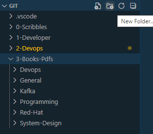
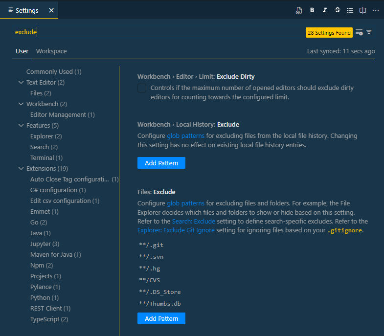
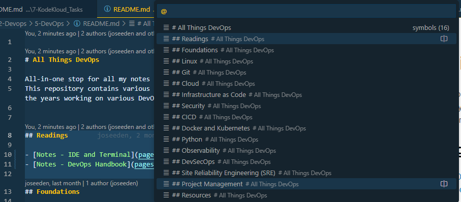
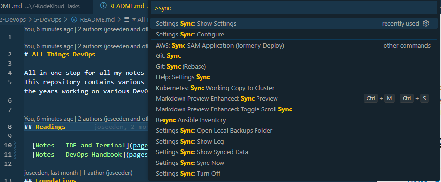
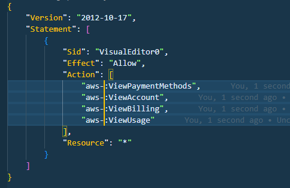
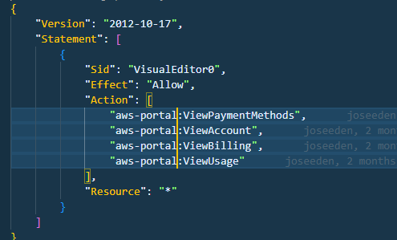
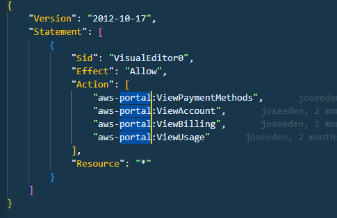

# IDE and Terminal Tricks

- [Terminal](#terminal)
    - [Useful Aliases](#useful-aliases)
- [CLI Tools](#cli-tools)
    - [CLI Completion](#cli-completion)
    - [VIM Shortcuts](#vim-shortcuts)
- [Visual Studio Code](#visual-studio-code)
    - [Undo and Redo](#undo-and-redo)
    - [Create nested folders](#create-nested-folders)
    - [Collapse all folders](#collapse-all-folders)
    - [Hidden Files](#hidden-files)
    - [Search inside a file](#search-inside-a-file)
    - [Run/Search for a command](#runsearch-for-a-command)
    - [Duplicate a line](#duplicate-a-line)
    - [Move a line](#move-a-line)
    - [Fold sections of a file](#fold-sections-of-a-file)
    - [Multicursor Editing adding same text to multiple lines](#multicursor-editing-adding-same-text-to-multiple-lines)
    - [Replace all Occurence](#replace-all-occurence)
    - [Linked Editing for HTML Tags](#linked-editing-for-html-tags)
    - [Shortcut for Keyboard Shortcuts](#shortcut-for-keyboard-shortcuts)
    - [Change keyboard shortcuts](#change-keyboard-shortcuts)
    - [HTML Trick - Emmet](#html-trick---emmet)
    - [Other Stuff](#other-stuff)


## Terminal 

### Useful Aliases

```bash
alias ld='ll -d */'
alias lf='ll -p | grep -v /'
alias cl='clear'
alias histgrep='history | grep' 
alias addalias='vi ~/.bashrc'
alias sr='source ~/.bashrc'
alias myip='export TF_VAR_my_ip="$(curl ifconfig.me)/32"'
alias awscreds='sudo vi ~/.aws/credentials'
```
```bash
alias gitacp='git add -A; git commit; git push'
alias gitac='git add -A; git commit'
alias gitst='git status' 
```

## CLI Tools 

### CLI Completion 

Enable completion for some of the available CLIs.

```bash
# Enable autocompletion for the Kubernetes cluster manager utility kubectl:
source <(kubectl completion bash)

# Enable autocompletion for Helm
source <(helm completion bash) 
```

### VIM Shortcuts 

Go to top of the file (first line of the file).

```bash
gg 
```

Go to bottom of the file (last line of the file).

```bash
Shift + g  
```

Copy an entire line.

```bash
yy 
```

Paste after a line.

```bash
p 
```

Insert an empty line below a line.

```bash
o 
```

Set line numbers.

```bash
:set number 
```

Go to a line (like line 10).

```bash
:10 
```


## Visual Studio Code 

### Undo and Redo 

Visual studio code follows the same:

```bash
# Undo 
Ctrl + z 

# Redo 
Ctrl + Shift + z
```

### Create nested folders 

Click the folder icon to add a folder.



To add nested folder, type the subsequent folders after "/".


### Collapse all folders 


### Hidden Files 

Some hidden files normally start with "." and are excluded from view. You can more excluded files by:

- Click gear icon at the bottom left ⚙
- Select Settings
- Search for "exclude" 
- To add more file format, click Add pattern

    


### Search inside a file 

To search for a particular section of a file or a code, we can use the shortcut below.
This saves time from scrolling over the whole file. This works with code too.

```bash
Ctrl + Shift + P --> @ 
```



### Run/Search for a command

To run a command, we can also use the same, then type the command.

```bash
Ctrl + Shift + P --> > 
```



### Duplicate a line 

To duplicate a line multiple times, click and hold the keys:

```bash
Alt + Shift + Down arrow 
```

### Move a line 

Similar to cutting a line and pasting it somewhere else in the file, we can also use the shortcut below.

```bash
Alt + Up/Down arrow 
```

### Fold sections of a file 

We can hide sections of a file by "folding" them.

```bash
Ctrl + Shift + p 
>fold all 
```

### Multicursor Editing (adding same text to multiple lines)

To type the same text on multiple places simulatenously:

```bash
Alt (hold) 
Use the mouse to click the places to edit
```




Note that in some cases, it could be:

```bash
Ctrl (hold) 
Use the mouse to click the places to edit  
```

### Replace all Occurence 

To replace all occurence of a text in a file (for example, the word), select the particular word and:

```bash
Shift + o 
```

All occurence of the word will be highlighted and will be edited at the same time.



The number of occurence will also appear at the bottom right.


### Linked Editing (for HTML Tags)

To edit the open and closing tag at the same time, we can enable linked editing.

```bash
Ctrl + Shift + p 
>linked editing 
```


### Shortcut for Keyboard Shortcuts 

Open the keyboard shortcuts page for the first time by

```bash
Ctrl + Shift + P
> keyboard shortcuts
```

Then select "Preferences: Open Keyboard Shortcuts"


Type "Open keyboard shortcuts". 
For the keybinding, click "CTRL (hold), K, S, enter"


The next time you want to see the keyboard shortcuts, just type:

```bash
Ctrl (hold) + k + s" 
```

### Change keyboard shortcuts 

Make sure to follow the step before this to set the shortcut for the keyboard shortcuts page first. To change or set a keyboard shortcut:

```bash
Ctrl (hold) + k + s" 
```

### HTML Trick - Emmet

This syntax assistance is particularly useful for HTML for writing boilerplate code.

To generate a layout, define the keywords/letters followed by "+" sign.
Example:

```bash
article>header+h1+p
press tab  
```
which will generate:

```html
<article></article>
<header></header>
<h1></h1> 
```

To create a numbered list with 10 items:

```bash
ul>li*5
press tab
```

which will generate:

```bash
<ul>
    <li></li>
    <li></li>
    <li></li>
    <li></li>
    <li></li>
</ul> 
```

### Other Stuff 

- Terminal - VS Code has a built-in terminal. Cons is that some Linux command doesn't work inside the terminal (e.g reverse search)

- Peek definitions/implementations 

- Integration with Git

- Remote repositories 

- Remote SSH 

- Remote containers

- .devcontainer 

- Debugger 

- Debugger: Breakpoint and Logpoint  

- HTTP Client like Thunder Client (for API testing)

- Docker extension 

- VS Code tasks (for repetitive shell commands)

- Snippets